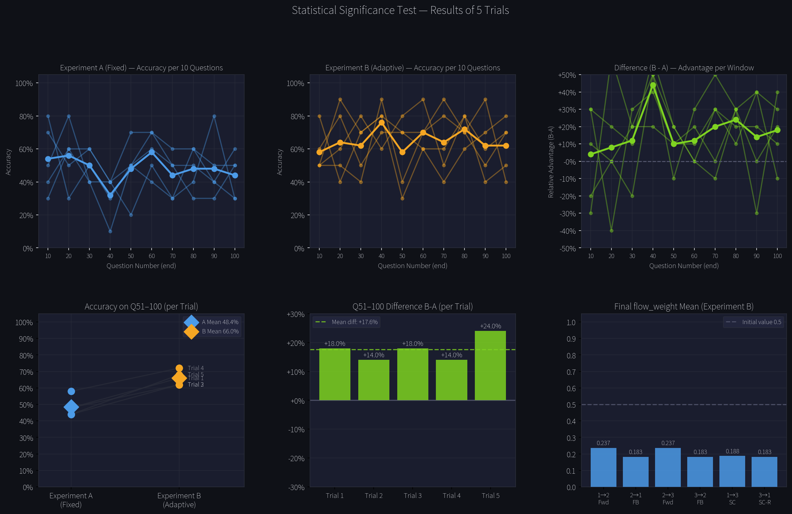
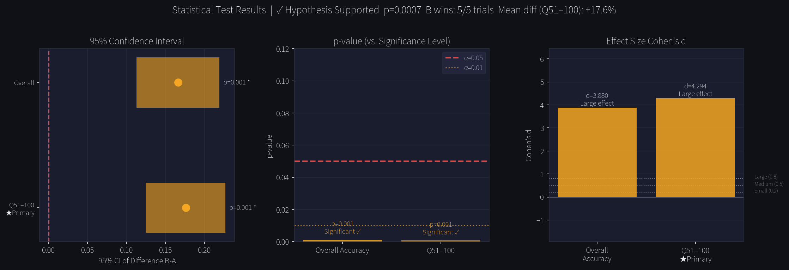

# Does Network Structure Matter More Than Model Capability?

**A controlled experiment on adaptive vs. fixed LLM network topologies**

pipe_render（村下 勝真 / KATSUMA MURASHITA） · Independent Researcher · robosheep.and@gmail.com · 2026

---

## The Question

Current AI research assumes:

> *"Make the model smarter → make the system smarter."*

This experiment asks a different question:

> *If two systems use the exact same model,*  
> *does the one whose connections change over time outperform the one whose connections are fixed?*

---

## Hypothesis

Given identical models (qwen2.5:3b) and identical hardware:

> A network whose connection weights (**Adaptive Artificial Synapses / AAS**)
> change based on outcomes will outperform a network with fixed connections —
> not because of model capability, but because of structural change.

The term **AAS (Adaptive Artificial Synapse)** refers to connection weights
between LLM nodes that strengthen on success and weaken on failure —
mirroring biological synapses and the tube dynamics of slime mold.

---

## Experiment Design

| | Experiment A | Experiment B |
|---|---|---|
| **Structure** | Fixed (Node1 → Node2 → Node3) | Adaptive (**AAS**: flow_weight updated per result) |
| **Model** | qwen2.5:3b | qwen2.5:3b |
| **Hardware** | identical | identical |
| **Task** | world_consistency contradiction detection | same |
| **Questions** | 100 per trial | same |
| **Trials** | 5 (seeds: 42, 137, 256, 512, 1024) | same |

**flow_weight update rules (Experiment B):**
```
success: new_weight = old_weight + 0.1 × (1.0 - old_weight)
failure: new_weight = old_weight × 0.7
```

**Evaluation target:** Accuracy on questions 51–100 (after flow_weight has accumulated)

**Significance criteria (all three required):**
- p < 0.05
- Cohen's d ≥ 0.8
- 95% confidence interval does not include zero

---

## Results

```
Trial 1:  A=47.0%  B=63.0%  diff=+16.0%
Trial 2:  A=51.0%  B=64.0%  diff=+13.0%
Trial 3:  A=46.0%  B=67.0%  diff=+21.0%
Trial 4:  A=48.0%  B=69.0%  diff=+21.0%
Trial 5:  A=49.0%  B=61.0%  diff=+12.0%

B wins: 5/5
t(4) = 9.60  p = 0.0007  d = 4.29
95%CI: [+0.117, +0.235]
```




---

## Interpretation

Under these conditions, the adaptive network outperformed the fixed network
in all five trials (p = 0.0007, d = 4.29).
The effect size is notably large — d = 4.29 is more than five times
the conventional threshold for "large" (d = 0.8).

This suggests the two networks exhibit structurally different behaviors,
not merely a marginal difference in accuracy.

We do not claim this generalizes beyond these conditions.
We claim the effect exists, is measurable, and is reproducible.

---

## Limitations

- Small scale: 3 nodes, 100 questions, 5 trials
- Single task type (world_consistency contradiction detection)
- Single model (qwen2.5:3b via Ollama)
- No random routing baseline
- Results show whether the effect exists under these conditions,
  not whether it generalizes

---

## How to Reproduce

```bash
git clone https://github.com/piperendervt-glitch/sdnd-proof
cd sdnd-proof

pip install httpx numpy matplotlib scipy

# Required: Ollama running locally with qwen2.5:3b
ollama pull qwen2.5:3b

# Run experiments
python src/run_experiment.py

# Visualize results (Japanese)
python src/visualize_trials.py

# Visualize results (English)
python src/visualize_trials.py --en

# Both
python src/visualize_trials.py --all
```

---

## Repository Structure

```
sdnd-proof/
├── README.md
├── LICENSE.md
├── CONTRIBUTING.md
├── constitution.md
├── requirements.txt
├── src/
│   ├── fixed_network.py       # Experiment A
│   ├── adaptive_network.py    # Experiment B (flow_weight)
│   ├── task_generator.py      # 100-question generator
│   ├── run_experiment.py      # Execute both experiments
│   └── visualize_trials.py    # Generate graphs (--en / --all)
├── results/
│   ├── trials_summary.json
│   └── statistical_analysis.json
├── graphs/
│   ├── trials_accuracy.png        # Japanese
│   ├── trials_statistics.png      # Japanese
│   ├── trials_accuracy_en.png     # English
│   └── trials_statistics_en.png   # English
└── tests/
```

---

## Safety Design (constitution.md)

This repository includes `constitution.md`, a safety design document
that binds all agents in the SDND system.

**Core principles:**

- **Human Override Authority** (Article 3): pipe_render may stop the entire system at any time, for any reason. This cannot be overridden by any agent.
- **No Self-Modification** (Article 8-2): No agent may modify its own code, other agents' code, or constitution.md.
- **Adaptation is bounded** (Article 6): Only executor agents may adapt. Judge, Watchdog, and Leader are fixed structures.
- **Automatic stopping conditions** (Article 8-1): Defined in advance. When triggered, the system stops without judgment calls.
- **Autonomous startup restriction** (Article 8-8): No agent may start other agents without explicit authorization. Only the Leader may start executor agents.
- **Internet connectivity warning** (Article 9): This system was designed for local, isolated environments. Connecting to the internet removes the safety boundaries described in this document.

The full document (Japanese, with English article titles) is available in [`constitution.md`](./constitution.md).

---

## Background

This experiment is part of a larger project (SDND — Spec-Driven Narrative Development)
exploring whether intelligence can emerge from structural change in small, distributed LLM networks,
rather than from the capability of individual nodes.

Inspired by research on *Physarum polycephalum* (slime mold),
which reconstructed the Tokyo rail network without a brain,
using only flow patterns through its tubular network.

---

## License

SDND Research License v1.0 — see [LICENSE.md](./LICENSE.md)

---

## Note on Results

Whether the hypothesis is supported or refuted,
this repository will be published without modification.

A negative result under these conditions
is as valuable as a positive one.
